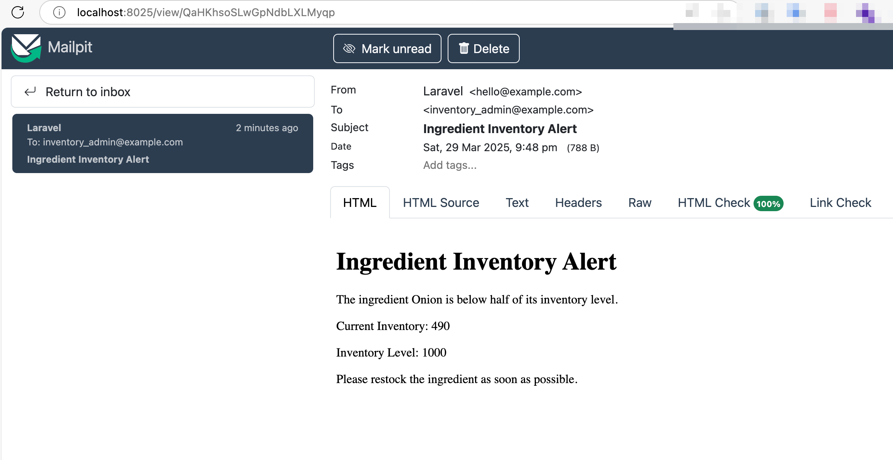
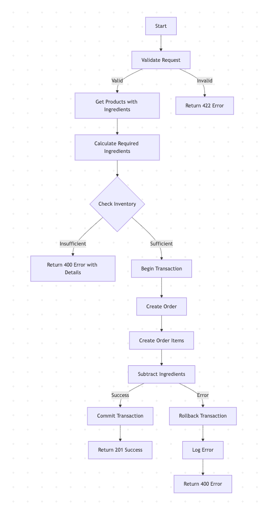

# Foodix Task

## Notes for the reviewer

- I've implemented some advanced concepts that could be considered an overkill for this simple task but I wanted to demonstrate how it would look like working in an environment where good practices are encouraged.
- However this task has been done over iterations, I only pushed one commit titled **"The Task"**, to make the reviewing process easy. Please review it directly from [the commits page](https://github.com/shahwan42/foodix-tsk/commits/main/).

## Install/Run The Project

### pre-requisites

- Docker
- [Laravel sail](https://laravel.com/docs/12.x/sail)

### run the project

- In the project directory, run `sail up`

### run the tests

- `sail test --filter="OrderControllerTest"`

### create an order

- run migrations `sail artisan migrate`
- seed the database `sail artisan db:seed`
- make a request

```cURL
curl --location 'laravel.test/api/orders' \
--header 'Accept: application/json' \
--header 'Content-Type: application/json' \
--data '{
    "products":[
        {
            "product_id": 1,
            "quantity": 3
        },
        {
            "product_id": 2,
            "quantity": 2
        }
    ]
}'
```

Example Response

```JSON
{
    "message": "Order created successfully",
    "result": {
        "updated_at": "2025-03-29T17:56:49.000000Z",
        "created_at": "2025-03-29T17:56:49.000000Z",
        "id": 3,
        "order_items": [
            {
                "id": 3,
                "order_id": 3,
                "product_id": 1,
                "quantity": 3,
                "created_at": "2025-03-29T17:56:49.000000Z",
                "updated_at": "2025-03-29T17:56:49.000000Z"
            },
            {
                "id": 4,
                "order_id": 3,
                "product_id": 2,
                "quantity": 2,
                "created_at": "2025-03-29T17:56:49.000000Z",
                "updated_at": "2025-03-29T17:56:49.000000Z"
            }
        ]
    }
}
```

### trigger ingredient alert

- create an order with product_id=1 & quantity=40
- run `sail artisan queue:work --queue=high`
- open mailpit in the browser `http://localhost:8025`
- email example:


## Design

### db design (some attrs are assumed/omitted)

orders  -> order representation

- no extra fields

order_items    -> (order lines) representation for each product/quantity in the order

- order_id: -> FK to Order
- product_id: -> FK to Product
- quantity:int -> quantity of Product

products    -> product representation

- name:str

ingredient_product:pivot    -> each product's ingredients and how much needed

- ingredient_id: -> FK to Ingredient
- product_id: -> FK to Product
- ingredient_weight:int -> weight (in grams) of ingredient composing the product

ingredients     -> ingredient representation

- name:str
- inventory_level:int  -> maximum capacity inventory can hold for the ingredient in grams
- alert_sent_at:datetime|null -> flag to know whether to send email notification for below 50% ingredient

ingredient_inventory_histories -> entries to record inventory changes

- ingredient_id: -> FK to Ingredient
- event:enum('add','subtract') -> determines whether the inventory of the ingredient is added-to or subtracted from
- weight: amount of grams added/subtracted

### Flowchart



### Improvements (Didn't have time to)

- Use Backed Enums (string) instead of constants
- Refactor Helpers in tests into a Trait for reusability
